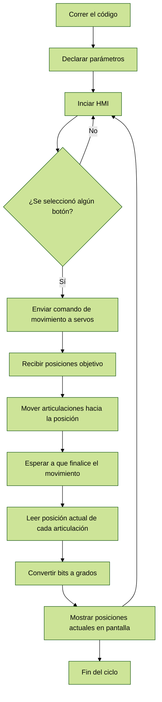

# Laboratorio_4_Robótica

El respectivo diagrama de flujo de las acciones del robot se puede visualizar a continuación

Se muestra el diagrama del robot con los parámetros articulares, realizado en [Glowbuzzer](https://direccion.de/la/pagina).

También encontramos los parámetros DH del robot con las medidas obtenidas

