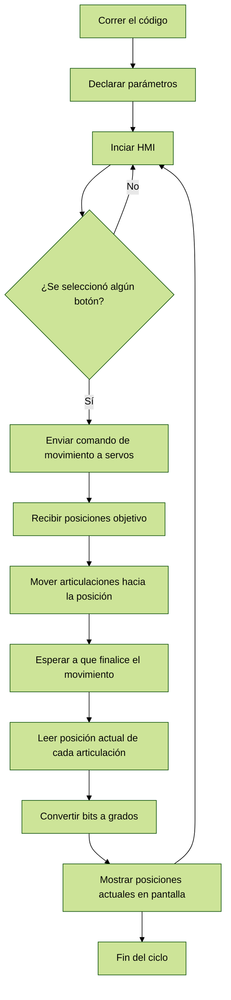

# Laboratorio_4_Robótica

El respectivo diagrama de flujo de las acciones del robot se puede visualizar a continuación

Se muestra el diagrama del robot con los parámetros articulares, realizado en [Glowbuzzer](https://direccion.de/la/pagina).

También encontramos los parámetros DH del robot con las medidas obtenidas.

| Eslabón | Longitud [mm] |
| :---: | :---: |
| 1 | 51.2 |
| 2 | 109.5 |
| 3| 105.8 |
| 4 | 64.1 |
| 5 | 45.5 |

| i  | θi | di | ai |  αi  |
| ------------- | ------------- | ------------- | ------------- | ------------- | 
| 1 | θ1  | L1 | 0 | -π/2 |
|  2 |  θ2 - π/2 | 0 | L2 | 0 |
|  3 |  θ3 | 0 | L3 | 0 |
|  4 |  θ4 + π/2 | 0 | L4 | 0 |
|  5 |  θ5 | L4 + L5 | 0 | 0 |

