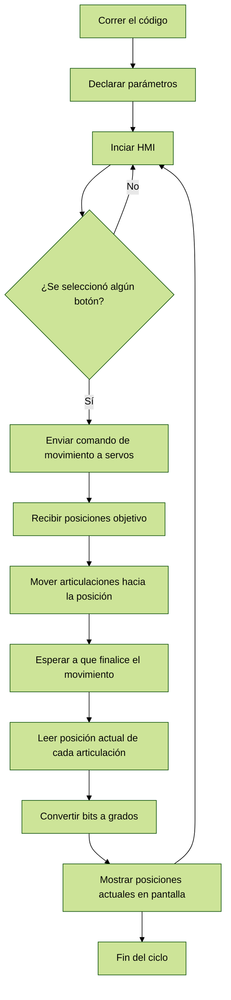

# Laboratorio_4_Robótica
Inicialmente, se analizó el manipulador Pincher, revisando sus articulaciones y el efector final. Con el objetivo de comprender mejor su funcionamiento, se elaboró un diagrama que facilita la visualización de sus articulaciones. Posteriormente, se calcularon los parámetros DH y se generó un diagrama utilizando la página [Glowbuzzer](https://direccion.de/la/pagina), la cual permite visualizar una aproximación del manipulador a partir de los parámetros DH.

<table>
  <tr>
    <th>Eslabón</th>
    <th>Longitud [mm]</th>
  </tr>
  <tr><td>1</td><td>51.2</td></tr>
  <tr><td>2</td><td>109.5</td></tr>
  <tr><td>3</td><td>105.8</td></tr>
  <tr><td>4</td><td>64.1</td></tr>
  <tr><td>5</td><td>45.5</td></tr>
</table>

<table>
  <tr>
    <th>i</th>
    <th>θi</th>
    <th>di</th>
    <th>ai</th>
    <th>αi</th>
  </tr>
  <tr>
    <td>1</td>
    <td>θ1</td>
    <td>L1</td>
    <td>0</td>
    <td>-π/2</td>
  </tr>
  <tr>
    <td>2</td>
    <td>θ2 - π/2</td>
    <td>0</td>
    <td>L2</td>
    <td>0</td>
  </tr>
  <tr>
    <td>3</td>
    <td>θ3</td>
    <td>0</td>
    <td>L3</td>
    <td>0</td>
  </tr>
  <tr>
    <td>4</td>
    <td>θ4 + π/2</td>
    <td>0</td>
    <td>L4</td>
    <td>0</td>
  </tr>
  <tr>
    <td>5</td>
    <td>θ5</td>
    <td>L4 + L5</td>
    <td>0</td>
    <td>0</td>
  </tr>
</table>

Posteriormente, se optó por realizar pruebas de conexión entre la máquina virtual y el manipulador Pincher. Al principio, hubo varios problemas, ya que la máquina virtual requería una configuración específica para poder leer los puertos seriales. Sin embargo, una vez establecida la conexión entre los servomotores Dynamixel y la máquina virtual, se comenzaron a probar las distintas posiciones solicitadas por el profesor. El objetivo de estas pruebas fue verificar que el robot no colisionara al ejecutar dichas poses.

Finalmente, se comenzó a programar la interfaz gráfica utilizando la biblioteca Tkinter de Python. Inicialmente, se configuraron los botones correspondientes a cada posición y, mediante condicionales, se asignó una posición a cada botón. Posteriormente, se ajustó la interfaz gráfica para mostrar los valores de las posiciones de las articulaciones en tiempo real. Finalmente, se añadieron algunos elementos a la interfaz, como el logo de la universidad y la información de los integrantes del grupo. El código correspondiente está en el repositorio y la lógica se muestra a continuación en un diagrama de flujo.

En el repositorio se encontrará información relevante del laboratorio, que incluye el plano de planta, el código implementado en Python, los diagramas utilizados durante el desarrollo del laboratorio, y una descripción detallada de las funciones empleadas en el código.

